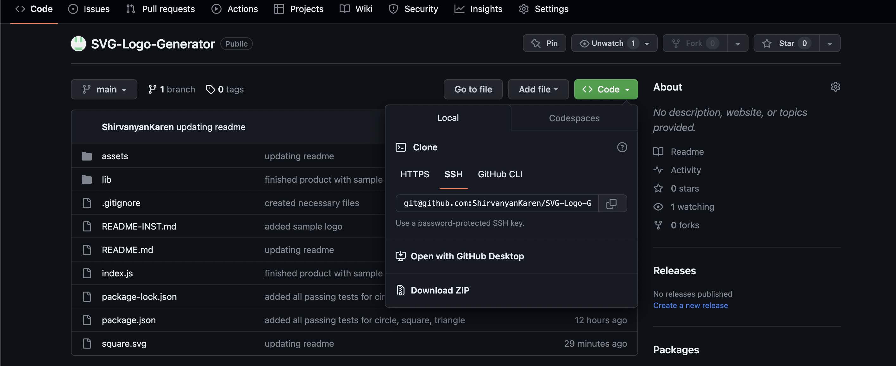
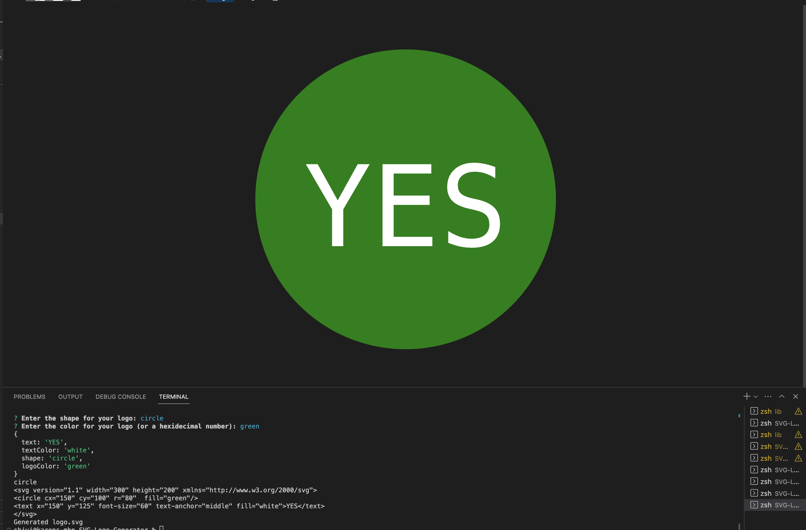

# SVG-Logo-Generator

# README-Generator


## Technology used
| Technology Used         | Resource URL           | 
| ------------- |:-------------:| 
| My Repository      | [https://github.com/ShirvanyanKaren/SVG-Logo-Generator](https://github.com/ShirvanyanKaren/SVG-Logo-Generator) |
| Node JS          | [https://nodejs.org/it/docs](https://nodejs.org/it/docs) |
| Git | [https://git-scm.com/](https://git-scm.com/)     | 


# Description

The purpose of this application is to create a README generator that prompts the users for various questions that represent section of the README file. Once The user has answered various questions including the title, choice of badge, installation, contributions, etc. then the desired markdown will be generated with the appropriate format.

The application had to meet the following acceptance criteria:

```md
GIVEN a command-line application that accepts user input
WHEN I am prompted for text
THEN I can enter up to three characters
WHEN I am prompted for the text color
THEN I can enter a color keyword (OR a hexadecimal number)
WHEN I am prompted for a shape
THEN I am presented with a list of shapes to choose from: circle, triangle, and square
WHEN I am prompted for the shape's color
THEN I can enter a color keyword (OR a hexadecimal number)
WHEN I have entered input for all the prompts
THEN an SVG file is created named `logo.svg`
AND the output text "Generated logo.svg" is printed in the command line
WHEN I open the `logo.svg` file in a browser
THEN I am shown a 300x200 pixel image that matches the criteria I entered
```

Here is an example of how the application runs:


## Table of Contents
* [Node JS](#node-js-and-svg-generator)
* [Installation](#installation)
* [Usage](#usage)
* [Contributions](#contributions)
* [License](#license)
* [Questions](#questions) 


## Node JS and SVG Generator

This application was developed using node js and node modules such as fs and inquirer. This project was made from scratch with no starter code. The initial step was adding the necessary node modules, initializing the package.json and then adding these necessary require paths to them in the index.js file.

### Class constructors and inheritance

I began with the shapes.js file, creating the Shape class which is essntially a template for the svg file with all the necessary inputs such as shape, color, text, and text color that I collect from the user.

```js
class Shape{

    constructor(shape = '', color, text, textColor){
        this.shape = shape;
        this.color = color;
        this.text = text;
        this.textColor = textColor;

    }
    render() {
 return `<svg version="1.1" width="300" height="200" xmlns="http://www.w3.org/2000/svg">
<${this.shape}  fill="${this.color}"/>
<text x="150" y="125" font-size="60" text-anchor="middle" fill="${this.textColor}">${this.text}</text>
</svg>`;

    }

}
```

I inherited the traits of the Shape class into each individual shape by including the extends syntax. The parameters were then defined with in this case circle being equal to the SVG paramters that create the circle logo. 

```js
class Circle extends Shape {
    constructor(circle, color, text, textColor){
        circle = `circle cx="150" cy="100" r="80"`;
        super(circle, color, text, textColor)
    }

}
```


### Passing user input to construct the logo

After prompting the user for questions about their unique SVG logo, I passed the response to the writeToFile function.

```js 
function init() {
    inquirer.prompt (
        questions
    )
    .then((response) => {
        console.log(response);
        writeToFile("file", response)
    })
```

After making constant references of the user inputs from the response, I initialized multiple if else if statements to define the shape with the users given parameters of logoColor, text, and textColor. These statements also create a name for the file under the logoFile that includes the shape the user picked for their svg file.

```js
 let logoFile;
    let userShape;
     if (shape === 'triangle') {
        logoFile = 'triangle.svg';
        userShape = new Triangle(undefined, logoColor, text, textColor);
     }
     else if (shape === 'square') {
        logoFile = 'square.svg';
        userShape = new Square(undefined, logoColor, text, textColor);
     }
     else if (shape === 'circle') {
        logoFile = 'circle.svg';
        userShape = new Circle(undefined, logoColor, text, textColor);
     }
     else {
        console.log("Your shape is invalide");
        return;
     }

```

The final step was to create a constant reference of the rendered userShape which I named svg. The rendered svg code for the shape was then passed into the fs.writeFile method that took the parameters of the file name, the data for the file (in this case the rendered svg code), and a call back function for an error. 

```js
    const svg = userShape.render();
    
    fs.writeFile(logoFile, svg, (err) => {
        if (err) throw err;
    });
    console.log('Generated logo.svg');

```


## Installation

Simple to install. Simply clone or fork these files from the repository



Then open the index.js in the integrated terminal and enter your responses


Finally, the application will devlop a README file with your inputs



## Usage 

This application can be used to create an SVG logo in the shape of a circle, square, or triangle with the user's desired text, text color, and logo color. 
        
## Credits

Jehyun Jung from the Central Tutoring Center helped me with running the tests for this application.
        
## License 
     
MIT licensing with permisions such as commercial use, modification, distribution and private use. Limitations include liability and warranty.

## Questions 

* Check out my other projects on my [my Github](https://github.com/ShirvanyanKaren)
* For any additional questions or concerns, please email me at kshirvanyan2000@gmail.com